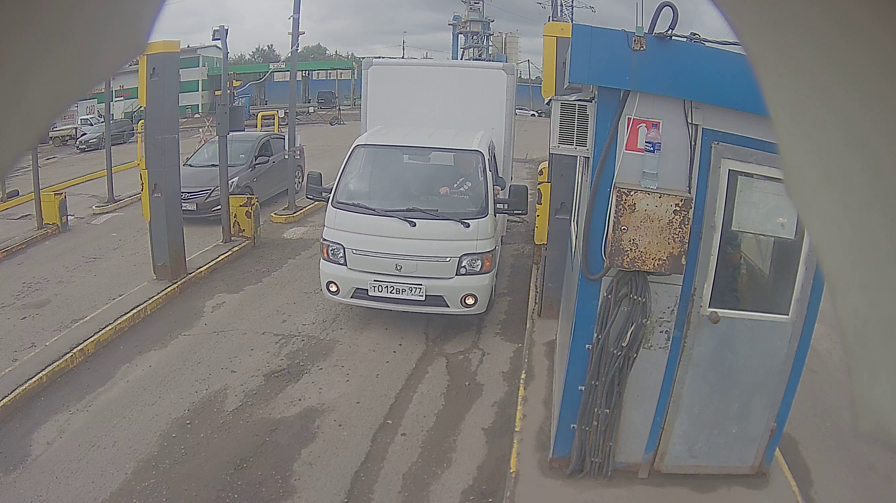
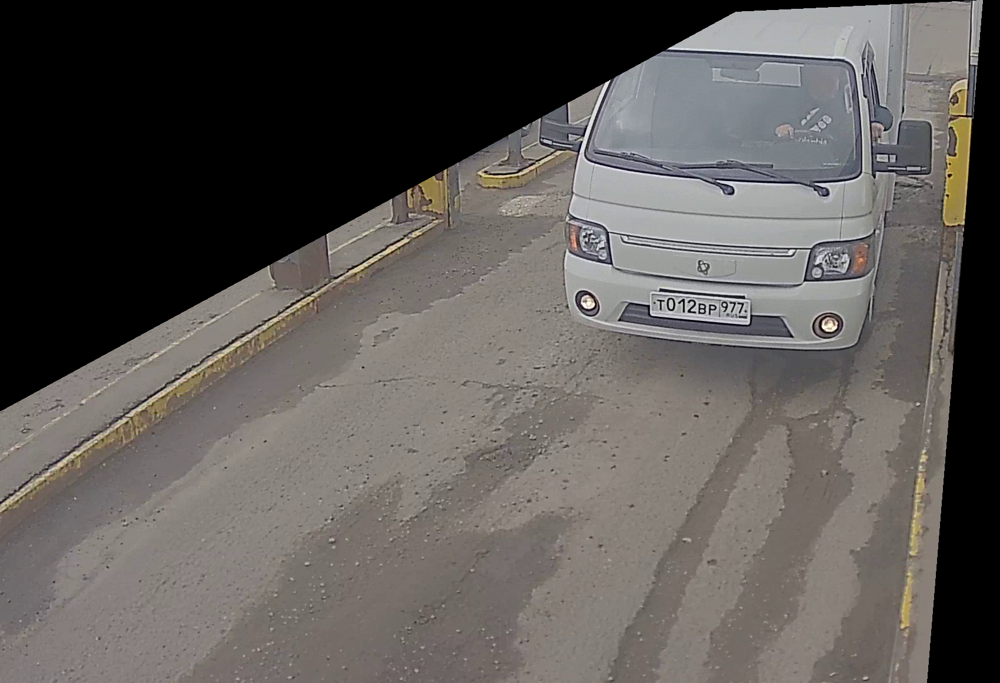

# Система обнаружения автомобиля перед шлагбаумом
**Как запустить**
1. pip install ultralytics
2. python detect_car.py --path *сюда путь до видео* (по умолчанию стоит cvtest.avi)

**Алгоритм работы**
1. На кадре выделяется область интереса:

Это позволяет не учитывать машины на соседнем шлагбауме
2. Обрезанный кадр подается на вход модели yolov11 - SOTA в компьютерном зрении прямо сейчас
3. Если модель нашла на изображении какой то из этих классов: 2: 'car', 3: 'motorcycle', 5: 'bus', 7: 'truck',
то добавляем в скользящее окно длинной 30 единичку
4. Если в скользящем окне хотя бы половина единиц, то считаем что в данный момент перед шлагбаумом есть автомобиль
Мы можем использовать такое скользящее окно, так как знаем что автомобиль движется плавно и не может моментально исчезнуть
Скользящее окно позволяет сгладить неточности модели (когда на двух соседних кадрах то есть машина, то нет)

